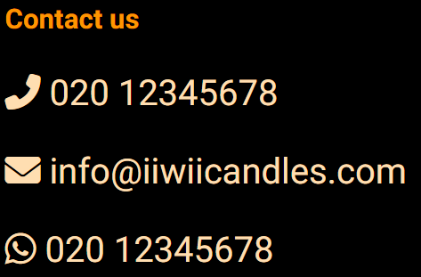

# IIWII- It is What It is!

This is my very first website-i hope you will like it.  IIWII is a website which is promoting to make eco and pet friendly candles at home.  
[IIWII](https://kristine-kiki.github.io/IIWII) please got to my website to see the project. It been desined for big varaty of devices to be navigated freely and efficiently.
 

## The Headeer
Company`s logo is at the top of the page what sets the main colour code for the page-black, golden orange and cream colour.

## Navigation Bar
Navigation Bar is under the Logo with shadowing effect, what makes it a good user`s experience. On larger screens they lines up, but on mobile devices they lines verticaly one under the other.

## Body
There are four sections in the page:
<ul><li><strong>Our Story</strong></li>
Gives inspiration and telling what is the purpose of the web page
<li><strong>Workshop</strong></li>
Explains what are the benefits for joining to IIWII
<li><strong>Contact</strong></li>
Contact list if vistitors have more specific questions
<li><strong>Sign Up!</strong></li>
Sign up section to recieve newest updates and information about how to make candles

## The Footer
Footer section includes relevant links to most popular social media web pages and copywrite signage. 

