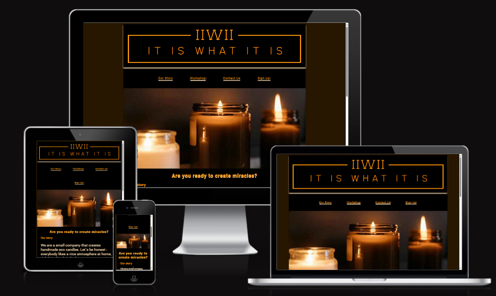
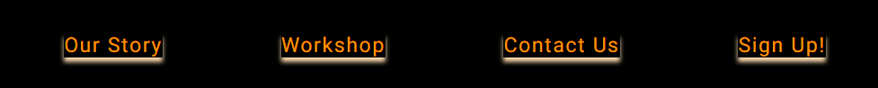
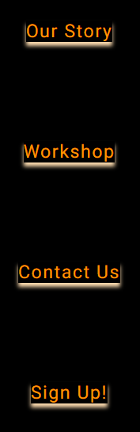
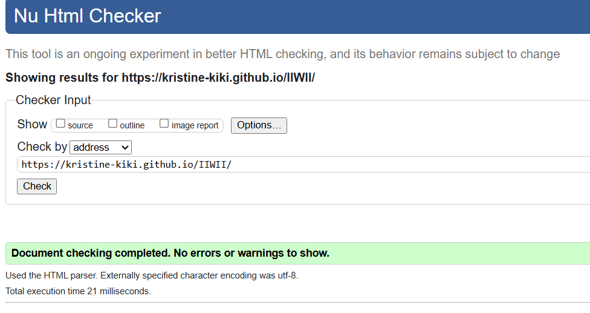
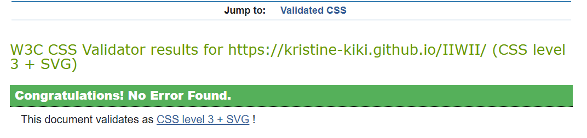
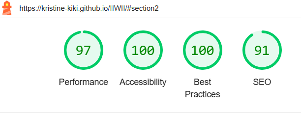

# IIWII- It is What It is!

This is my very first website-i hope you will like it.  IIWII is a website which is promoting to make eco and pet friendly candles at home.  
[IIWII](https://kristine-kiki.github.io/IIWII) please got to my website to see the project. It been desined for big varaty of devices to be navigated freely and efficiently.
 

## The Headeer
The website features a company logo at the top, setting the main color scheme for the page (black, golden orange, and cream)

## Navigation Bar
Located below the logo, the navigation bar has a shadow effect for a good user experience. On larger screens, the navigation items line up horizontally, while on mobile devices, they stack vertically.

## Body
There are four sections in the page:
<ul><li><strong>Our Story</strong></li>
Provides inspiration and explains the purpose of the website
<li><strong>Workshop</strong></li>
Describes the benefits of joining IIWII.
<li><strong>Contact</strong></li>
Allows visitors to sign up for updates and information on candle-making.
<li><strong>Sign Up!</strong></li>
Sign up section to recieve newest updates and information about how to make candles 

## The Footer
Includes relevant links to popular social media pages and a copyright notice. 

## Testing
HTML  No errors found when running the code through the [V3C HTML Validator](https://validator.w3.org/) 

CSS  No errors found when running the code through the [V3C CSS Validator](https://jigsaw.w3.org/css-validator/)

I run through Lighthouse and checked all the funcions is working

Navigation links, social media links, and browser compatibility were tested successfully. There has been flaged out there could be Potential savings of Defer offscreen images.

## Deployment
Web page was created by using Github.Created new repository as per instructions. Repository "Good Street" after changed to "IIWII".That is because I changed the project. I was using "git add . " for adding the files and "git commit -m" to commit changes i was making, "git push" was used to push changes to repository on Github.

## Deployment to Github pages

Github repository-Settings-Branch-chainged to "main"-Saved. System provided live link to [IIWII](https://kristine-kiki.github.io/IIWII).

## Wireframes
Unfortunately I did not use Wireframes as I did not know about them. I was drafting web page layout in my notebook. At the beggining it helped, but with chaping the project I faced difficulties. About Balsamiq I learned just on the day i needed to submit my project. Absolutely will use it in the future.

## Credits
Acknowledgments go to Slack users Hannah O. and IoanZaharia_5p and Tomas_K_Alumni_lead
 , as well as the mentor and tutor support.

## Content
As suggested I was using [Font Awesome](https://fontawesome.com/) and [Favicon](https://favicon.io/). Pictures were taken from [Pexels](https://www.pexels.com/). Was using spellcheck as well.
